# Procesverslag
Markdown is een simpele manier om HTML te schrijven.  
Markdown cheat cheet: [Hulp bij het schrijven van Markdown](https://github.com/adam-p/markdown-here/wiki/Markdown-Cheatsheet).

Nb. De standaardstructuur en de spartaanse opmaak van de README.md zijn helemaal prima. Het gaat om de inhoud van je procesverslag. Besteedt de tijd voor pracht en praal aan je website.

Nb. Door *open* toe te voegen aan een *details* element kun je deze standaard open zetten. Fijn om dat steeds voor de relevante stuk(ken) te doen.

## Jij

  
uitwerken voor kick-off werkgroep

  ### Auteur:
  Beau van Dijk

  #### Je startniveau:
  Rood

  #### Je focus:
  Surface plane
 

## Je website

  
uitwerken voor kick-off werkgroep

  ### Je opdracht:
  https://www.wwf.nl/

  #### Screenshot(s) van de eerste pagina (small screen): 
  Homepagina 
  

  #### Screenshot(s) van de tweede pagina (small screen):
  Kom in actie pagina  
  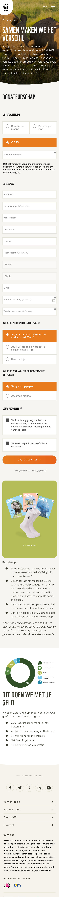
 

## Toegankelijkheidstest 1/2 (week 1)

  
uitwerken na test in 1e werkgroep

  ### Bevindingen
  Lijst met je bevindingen die in de test naar voren kwamen:

  #### Screenreader
  Hier korte omschrijving (met indien nodig afbeeldingen)
  Heel vervelend en kan lang duren voordat je bent waar je wilt zijn 

  Hier een omschrijving van hoe het opgelost kan worden (met indien nodig afbeeldingen)
  Kopjes en titels meer specifieker maken bij een onderwerp zodat ge gebruiker sneller naar de pagina komen waar hij naar opzoek is. 

  #### Muis en Toetsenbord 
  Hier korte omschrijving (met indien nodig afbeeldingen)
  ?? Je kan niet goed klikken met de muis of trackpad waardoor je verkeerd of niet kunt klikken

  Hier een omschrijving van hoe het opgelost kan worden (met indien nodig afbeeldingen)
  Harder drukken op te toetsen voordat er een letter komt of langer ingedrukt houden
  De cursor van de muis slomer maken zodat je gemakkelijker kan klikken of het klikveld groter maken 

  #### Motoriek (shocks, elastiekjes)
  Hier korte omschrijving (met indien nodig afbeeldingen)
  Het is vervelend om geconcentreerd aan het werk te gaan of snel iets op te zoeken 
  
  -Je kan niet goed typen 
  -Moeilijk navigeren 

  Hier een omschrijving van hoe het opgelost kan worden (met indien nodig afbeeldingen)
  Op de website meer tijd krijgen en dat te toetsen harder ingedrukt moeten worden of langer duren zodat er geen typfouten komen

  #### Visueel (brillen, contrast, kleurenblind, dark/light). 
  Hier korte omschrijving (met indien nodig afbeeldingen)
  Tunnel visie
  -Je moet goed met je ogen knijpen om te concentreren 
  -Ziet niet heel goed

  Vlek in het midden 
  -Je kan wel goed zien maar is wel vervelend 
  -Je moet goed concentreren 

  Toegankelijk 
  Het is vervelend en je moet er meer inspanning voor doen maar het valt uiteindelijk best wel mee
  -Je hebt minder zicht maar ziet wel goed 
  -Het is niet heel vervelend

  Hier een omschrijving van hoe het opgelost kan worden (met indien nodig afbeeldingen)
  Langer de tijd nemen 

## Breakdownschets (week 1)

  
uitwerken na afloop 2e werkgroep

  ### de hele pagina: 
  
  

  ### dynamisch deel (bijv menu): 
  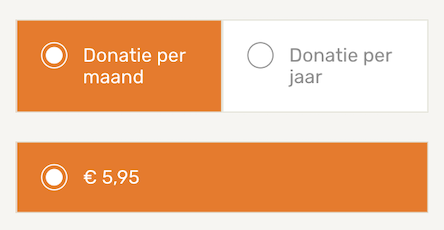

  ### wellicht nog een dynamisch deel (bijv filter): 
  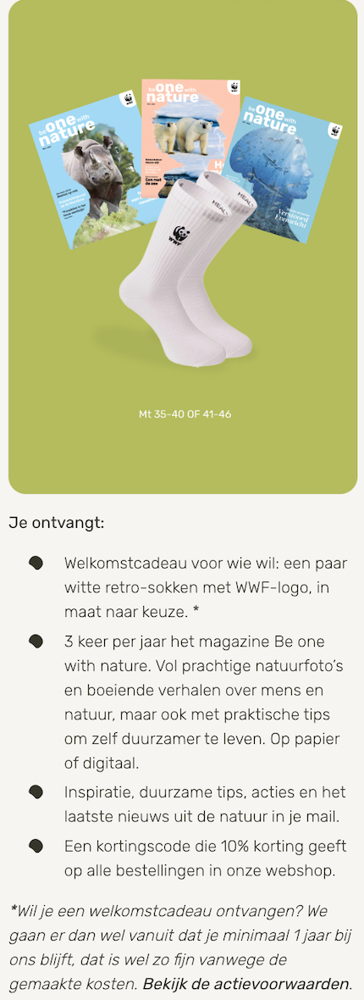

  ### wellicht nog een dynamisch deel (bijv filter): 
  

  ### wellicht nog een dynamisch deel (bijv filter): 
  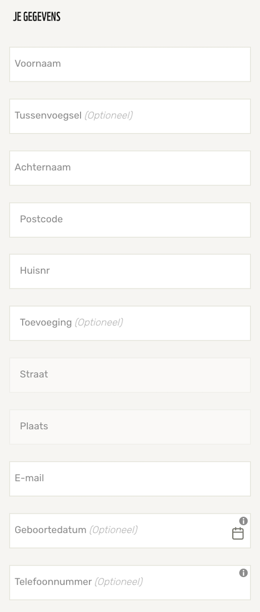

## Voortgang 1 (week 2)

  
uitwerken voor 1e voortgang

  ### Stand van zaken
  hier dit ging goed & dit was lastig (neem ook screenshots op van delen van je website en code)
   klein nieuws stukje minder goed
   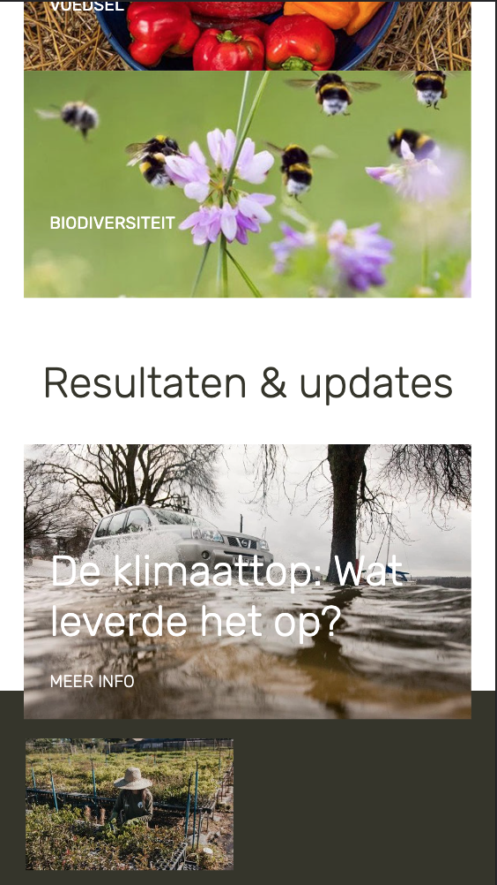
   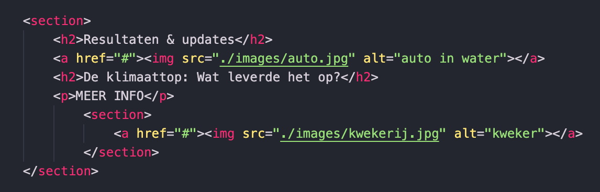
   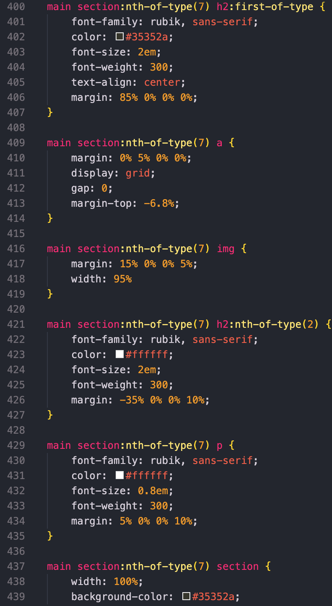
    Ik heb er uiteindelijk 2 sections van gemaakt met dezelfde opmaak dat was voor mij de beste oplossing om het te maken. 
    de rest van de pagina ging goed

  ### Agenda voor meeting
  samen met je groepje opstellen
  We hadden samen besproken dat we ieder 20 minuten van het uur namen om onze vragen te stellen en feedback te krijgen. 

  | student 1      | student 2          | student 3    | student 4        |
  | ---            | ---                | ---          | ---              |
  | dit bespreken  | en dit             | en ik dit    | en dan ik dat    |
  | en dat ook nog | dit als er tijd is | nog een punt | dit wil ik zeker |
  | ...            | ...                | ...          | ...              |

  ### Verslag van meeting
  hier na afloop snel de uitkomsten van de meeting vastleggen

  - Ik was de body vergeten in mijn HTML en dan zou mijn website eigenlijk niet staan maar hij deed het wel en ik had alleen main
  - Ik zou mijn headings kunnen versimpelen bij main H1 etc te maken en als ik het anders wil moet ik het specifiek aanpassen bijv met margin erbij zodat ik niet alles opnieuw steeds hoef te typen. 
 

## Voortgang 2 (week 3)

  
uitwerken voor 2e voortgang

  ### Stand van zaken
  hier dit ging goed & dit was lastig (neem ook screenshots op van delen van je website en code)
  
  Het maken van het menu ging makkelijk met de javascript na het maken van de opdracht, dus dat ging soepel. Toen ik de positie van de button wou gaan verplaatsen dat ging wat minder, want ik kreeg er soms geen beweging in en ik had een heel klein grijs bolletje erbij die ik ook niet wegkreeg. Daarbij was het hamburger menu als je hem wou sluiten niet gelijk met icoon om hem te openen, dit kwam doordat de sluitmenu 2 naast elkaar had en de ene die zag je niet. 
  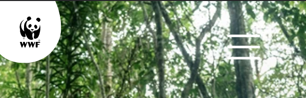

  Bij de footer heb ik 6 logo's die ik 2 om 4 wou neerzetten maar dat wou ik met een grid gaan maken, maar dat lukte mij niet echt. De student assistent heeft mij geholpen en heeft er een UL van gemaakt met een grid. Dit zit wel 2 om 4 apart in een ul verpakt. 
  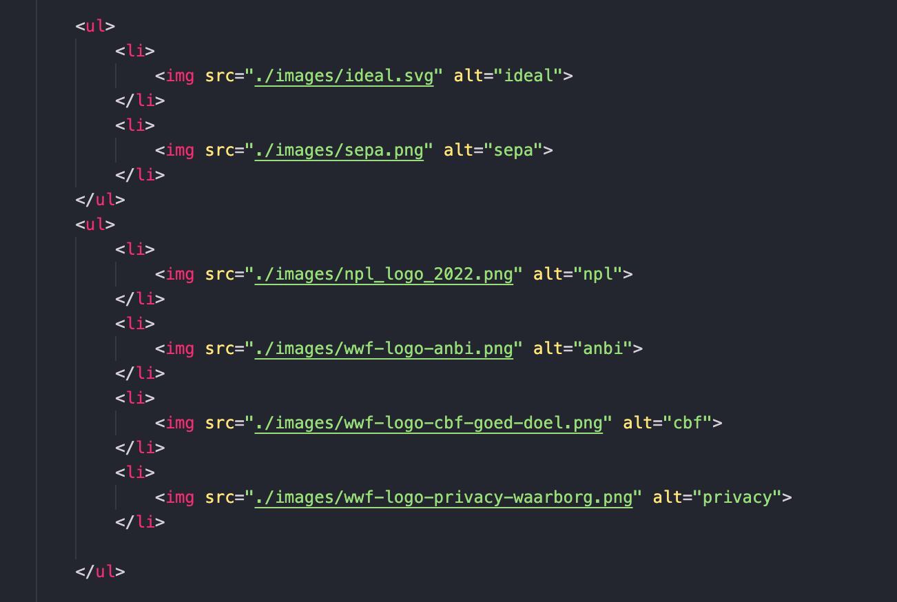
  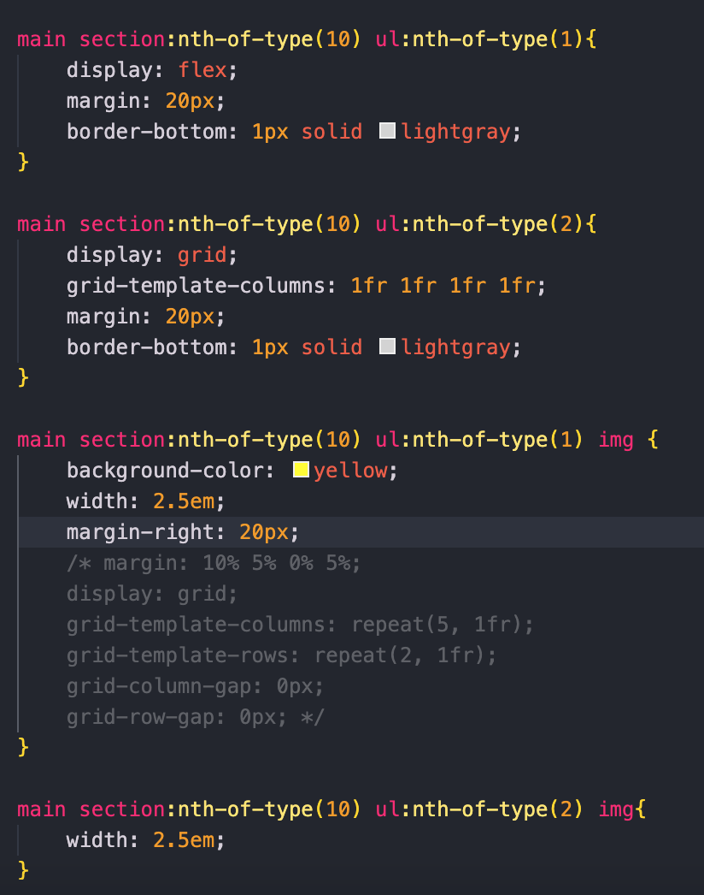
  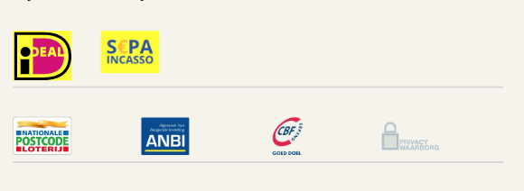

  ### Agenda voor meeting
  samen met je groepje opstellen

  | student 1      | student 2          | student 3    | student 4        |
  | ---            | ---                | ---          | ---              |
  | dit bespreken  | en dit             | en ik dit    | en dan ik dat    |
  | en dat ook nog | dit als er tijd is | nog een punt | dit wil ik zeker |
  | ...            | ...                | ...          | ...              |

  ### Verslag van meeting
  hier na afloop snel de uitkomsten van de meeting vastleggen

  - punt 1
  - punt 2
  - nog een punt
- ...

## Toegankelijkheidstest 2/2 (week 4)

  
uitwerken na test in 8e werkgroep

  ### Bevindingen
  Lijst met je bevindingen die in de test naar voren kwamen (geef ook aan wat er verbeterd is):

  #### Screenreader
  Hier korte omschrijving (met indien nodig afbeeldingen)

  Hier een omschrijving van hoe het opgelost kan worden (met indien nodig afbeeldingen)

  #### Muis en Toetsenbord 
  Hier korte omschrijving (met indien nodig afbeeldingen)

  Hier een omschrijving van hoe het opgelost kan worden (met indien nodig afbeeldingen)

  #### Motoriek (shocks, elastiekjes)
  Hier korte omschrijving (met indien nodig afbeeldingen)

  Hier een omschrijving van hoe het opgelost kan worden (met indien nodig afbeeldingen)

  #### Visueel (brillen, contrast, kleurenblind, dark/light). 
  Hier korte omschrijving (met indien nodig afbeeldingen)

  Hier een omschrijving van hoe het opgelost kan worden (met indien nodig afbeeldingen)

## Voortgang 3 (week 4)

  
uitwerken voor 3e voortgang

  ### Stand van zaken
  hier dit ging goed & dit was lastig (neem ook screenshots op van delen van je website en code)

  ### Agenda voor meeting
  samen met je groepje opstellen

  | student 1      | student 2          | student 3    | student 4        |
  | ---            | ---                | ---          | ---              |
  | dit bespreken  | en dit             | en ik dit    | en dan ik dat    |
  | en dat ook nog | dit als er tijd is | nog een punt | dit wil ik zeker |
  | ...            | ...                | ...          | ...              |

  ### Verslag van meeting
  hier na afloop snel de uitkomsten van de meeting vastleggen

  - punt 1
  - punt 2
  - nog een punt
  - ...

## Eindgesprek (week 5)

  
uitwerken voor eindgesprek

  ### Je uitkomst - karakteristiek screenshots:
  

  ### Dit ging goed/Heb ik geleerd: 
  Korte omschrijving met plaatjes

  

  ### Dit was lastig/Is niet gelukt:
  Korte omschrijving met plaatjes

  

## Bronnenlijst

  
continu bijhouden terwijl je werkt

  Nb. Wees specifiek ('css-tricks' als bron is bijv. niet specifiek genoeg).

  1. bron 1
  2. bron 2
  3. ...

