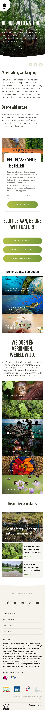
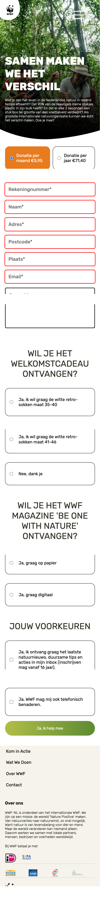
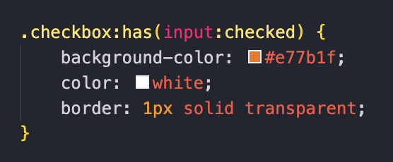

# Procesverslag
Markdown is een simpele manier om HTML te schrijven.  
Markdown cheat cheet: [Hulp bij het schrijven van Markdown](https://github.com/adam-p/markdown-here/wiki/Markdown-Cheatsheet).

Nb. De standaardstructuur en de spartaanse opmaak van de README.md zijn helemaal prima. Het gaat om de inhoud van je procesverslag. Besteedt de tijd voor pracht en praal aan je website.

Nb. Door *open* toe te voegen aan een *details* element kun je deze standaard open zetten. Fijn om dat steeds voor de relevante stuk(ken) te doen.

## Jij

  
uitwerken voor kick-off werkgroep

  ### Auteur:
  Beau van Dijk

  #### Je startniveau:
  Rood

  #### Je focus:
  Surface plane
 

## Je website

  
uitwerken voor kick-off werkgroep

  ### Je opdracht:
  https://www.wwf.nl/

  #### Screenshot(s) van de eerste pagina (small screen): 
  Homepagina 
  

  #### Screenshot(s) van de tweede pagina (small screen):
  Kom in actie pagina  
  
 

## Toegankelijkheidstest 1/2 (week 1)

  
uitwerken na test in 1e werkgroep

  ### Bevindingen
  Lijst met je bevindingen die in de test naar voren kwamen:

  Veel klikken 
  Onnodige hovers 
  Soms teveel elementen 

  #### Screenreader
  Hier korte omschrijving (met indien nodig afbeeldingen)
  Heel vervelend en kan lang duren voordat je bent waar je wilt zijn 

  Hier een omschrijving van hoe het opgelost kan worden (met indien nodig afbeeldingen)
  Kopjes en titels meer specifieker maken bij een onderwerp zodat de gebruiker sneller naar de pagina komen waar hij naar opzoek is. 

  #### Muis en Toetsenbord 
  Hier korte omschrijving (met indien nodig afbeeldingen)
  Je kan niet goed klikken met de muis of trackpad waardoor je verkeerd of niet kunt klikken

  Hier een omschrijving van hoe het opgelost kan worden (met indien nodig afbeeldingen)
  Harder drukken op te toetsen voordat er een letter komt of langer ingedrukt houden
  De cursor van de muis slomer maken zodat je gemakkelijker kan klikken of het klikveld groter maken 

  #### Motoriek (shocks, elastiekjes)
  Hier korte omschrijving (met indien nodig afbeeldingen)
  Het is vervelend om geconcentreerd aan het werk te gaan of snel iets op te zoeken 
  
  -Je kan niet goed typen 
  -Moeilijk navigeren 

  Hier een omschrijving van hoe het opgelost kan worden (met indien nodig afbeeldingen)
  Op de website meer tijd krijgen en dat te toetsen harder ingedrukt moeten worden of langer duren zodat er geen typfouten komen

  #### Visueel (brillen, contrast, kleurenblind, dark/light). 
  Hier korte omschrijving (met indien nodig afbeeldingen)
  Tunnel visie
  -Je moet goed met je ogen knijpen om te concentreren 
  -Ziet niet heel goed

  Vlek in het midden 
  -Je kan wel goed zien maar is wel vervelend 
  -Je moet goed concentreren 

  Toegankelijk 
  Het is vervelend en je moet er meer inspanning voor doen maar het valt uiteindelijk best wel mee
  -Je hebt minder zicht maar ziet wel goed 
  -Het is niet heel vervelend

  Hier een omschrijving van hoe het opgelost kan worden (met indien nodig afbeeldingen)
  Langer de tijd nemen 

## Breakdownschets (week 1)

  
uitwerken na afloop 2e werkgroep

  ### de hele pagina: 
  
  

  ### dynamisch deel (bijv menu): 
  

  ### wellicht nog een dynamisch deel (bijv filter): 
  

  ### wellicht nog een dynamisch deel (bijv filter): 
  

  ### wellicht nog een dynamisch deel (bijv filter): 
  

## Voortgang 1 (week 2)

  
uitwerken voor 1e voortgang

  ### Stand van zaken
  hier dit ging goed & dit was lastig (neem ook screenshots op van delen van je website en code)
   klein nieuws stukje minder goed
   
   
   
    Ik heb er uiteindelijk 2 sections van gemaakt met dezelfde opmaak dat was voor mij de beste oplossing om het te maken. 
    de rest van de pagina ging goed

  ### Agenda voor meeting
  samen met je groepje opstellen
  We hadden samen besproken dat we ieder 20 minuten van het uur namen om onze vragen te stellen en feedback te krijgen. 

  ### Verslag van meeting
  hier na afloop snel de uitkomsten van de meeting vastleggen

  - Ik was de body vergeten in mijn HTML en dan zou mijn website eigenlijk niet staan maar hij deed het wel en ik had alleen main
  - Ik zou mijn headings kunnen versimpelen bij main H1 etc te maken en als ik het anders wil moet ik het specifiek aanpassen bijv met margin erbij zodat ik niet alles opnieuw steeds hoef te typen. 
 

## Voortgang 2 (week 3)

  
uitwerken voor 2e voortgang

  ### Stand van zaken
  hier dit ging goed & dit was lastig (neem ook screenshots op van delen van je website en code)
  
  Het maken van het menu ging makkelijk met de javascript na het maken van de opdracht, dus dat ging soepel. Toen ik de positie van de button wou gaan verplaatsen dat ging wat minder, want ik kreeg er soms geen beweging in en ik had een heel klein grijs bolletje erbij die ik ook niet wegkreeg. Daarbij was het hamburger menu als je hem wou sluiten niet gelijk met icoon om hem te openen, dit kwam doordat de sluitmenu 2 naast elkaar had en de ene die zag je niet. 
  

  Bij de footer heb ik 6 logo's die ik 2 om 4 wou neerzetten maar dat wou ik met een grid gaan maken, maar dat lukte mij niet echt. De student assistent heeft mij geholpen en heeft er een UL van gemaakt met een grid. Dit zit wel 2 om 4 apart in een ul verpakt. 
  
  
  

  ### Agenda voor meeting
  samen met je groepje opstellen
  We hadden samen besproken dat we ieder 20 minuten van het uur namen om onze vragen te stellen en feedback te krijgen. 

  ### Verslag van meeting
  hier na afloop snel de uitkomsten van de meeting vastleggen

  - Bij de tekst met afbeelding de P in de A zetten met position absolute. De a moet position relative 
  gebruiken. 
  - HR niet gebruiken border bottom gebruiken. 
 

## Toegankelijkheidstest 2/2 (week 4)

  
uitwerken na test in 8e werkgroep

  ### Bevindingen
  Lijst met je bevindingen die in de test naar voren kwamen (geef ook aan wat er verbeterd is):

  Het menu was niet zichtbaar bij de screenreader

  Ik heb minder onnodige hovers en elementen wegehaald want dat neemt ook extra tijd in als je snel iet wilt gaan lezen of naar toe gaan.

  #### Screenreader
  Hier korte omschrijving (met indien nodig afbeeldingen)
  Het ging eigenlijk best wel soepel met het per stuk lezen van de website, maar soms wel een beetje sloom  

  Hier een omschrijving van hoe het opgelost kan worden (met indien nodig afbeeldingen)
  De screenreader zelf zou een update moeten krijgen en beter moeten kunnen onderscheiden wat de elementen/content zijn/is. Zo kan de gebruiker beter zijn weg vinden op de website

  #### Muis en Toetsenbord 
  Hier korte omschrijving (met indien nodig afbeeldingen)
  Het toetsenbord is wel makkelijk te gebruiken voor als je kunt zien, maar niet voor slechtziende/blinde mensen.

  Hier een omschrijving van hoe het opgelost kan worden (met indien nodig afbeeldingen)
  Voor de slechtziende/blinde mensen zou ik een braille toetsenbord en muis gebruiken
  Voor de mensen die de letters niet gebruiken missen een toetsenbord met tekens die ze wel kennen gebruiken als dat bestaat.

  #### Motoriek (shocks, elastiekjes)
  Hier korte omschrijving (met indien nodig afbeeldingen)
  Het is heel lastig om te scrollen met de trackpad van de macbook want het trillen van de hand maakt het veel lastiger. 
  Met de elastiekjes kun je ook moeilijk scrollen want je hebt bij de trackpad een aantal vingers nodig om te scrollen of een andere interactie te doen.

  Hier een omschrijving van hoe het opgelost kan worden (met indien nodig afbeeldingen)
  Bij de shocks een externe muis toevoegen zodat je gemakkelijker kan klikken en scrollen
  Bij de elastiekjes zou ik wel de trackpas houden maar dan de onderdelen om te scrollen op een andere manier zoals lang op de onder of bovenkant van de trackpad drukken 

  #### Visueel (brillen, contrast, kleurenblind, dark/light). 
  Hier korte omschrijving (met indien nodig afbeeldingen)
   
   Tunnel visie
  -Je moet goed met je ogen knijpen om te concentreren 
  -Je kan niet goed zien

  Vlek in het midden 
  -Je kan wel goed zien maar is irritant
  -Je moet goed kunnen concentreren 

  Contrast/kleurenblind
  -Het is moeilijk om de kleuren te onderscheiden vooral als je iets fout hebt gedaan en de kleur rood niet kunt zien

  Hier een omschrijving van hoe het opgelost kan worden (met indien nodig afbeeldingen)
  Langer de tijdnemen en extra informatie erbij zetten als nodig is zodat je weet dat het zo moet

## Voortgang 3 (week 4)

  
uitwerken voor 3e voortgang

  ### Stand van zaken
  hier dit ging goed & dit was lastig (neem ook screenshots op van delen van je website en code)

  Ik was bezig met een animatie op een knop op de homepagina en op een gegeven moment was ik daarmee klaar maar hij deed het niet. Ik heb op verschillende manieren geprobeerd om het te laten werken maar tevergeefs. Ik had het aan de studentassistent gevraagd en die zei eerst ook van dat het goed is gecodeerd, maar ook niet zo snel wist. Uiteindelijk was het probleem dat de div een display: flex nodig had, maar we wisten allebei niet waarom dat zo moest. 

  ### Agenda voor meeting
  samen met je groepje opstellen
  We hadden samen besproken dat we ieder 20 minuten van het uur namen om onze vragen te stellen en feedback te krijgen. 

  ### Verslag van meeting
  hier na afloop snel de uitkomsten van de meeting vastleggen
  Er waren eigenlijk niet veel punten wat ik echt zou moeten verbeteren

  - Sommige afbeeldingen mogen wel een zwarte gradient hebben want de witte tekst is soms niet leesbaar 

## Eindgesprek (week 5)

  
uitwerken voor eindgesprek

  ### Je uitkomst - karakteristiek screenshots:
  
  

  ### Dit ging goed/Heb ik geleerd: 
  Korte omschrijving met plaatjes
  Over het algemeen ging het best goed. ik had weinig dingen waar ik nou echt mee zat. Het enige was wel dat ik soms de basis onderdelen was vergeten zoals een body aanmaken of de footer in de footer zetten in plaats van als section.

  Ik heb de :has en :checked erbij geleerd
  Ik weet dat je het waarschijnlijk heel makkelijk ook met classes kunt doen, maar dit is voor mij ook veel makkelijker en het is ook specifieker in je css. 
  
  
  Animaties
  Ik had wel al een idee van de animaties maar ik was er nog niet veel verder op in gegaan. Ik weet nu wel ongeveer hoe ik een animatie kan maken, maar ik zou daar dan wel nog een beetje hulp bij moeten krijgen. 

  ### Dit was lastig/Is niet gelukt:
  Korte omschrijving met plaatjes
  
  Valid en invalid 
  Het is mij soort van wel gelukt, maar de invalid blijft domineren en als ik iets heb ingevuld dan gaat hij naar de valid. Ik heb ook een focus erop maar die werkt alleen op de opmerkingen. Ik wilde nog de intermediate state toevoegen maar dat is niet gelukt.  
  

## Bronnenlijst

  
continu bijhouden terwijl je werkt

  Nb. Wees specifiek ('css-tricks' als bron is bijv. niet specifiek genoeg).

  1. De slides/opdrachten op DLO van het vak frontend development
  2. Aria label https://developer.mozilla.org/en-US/docs/Web/Accessibility/ARIA/Attributes/aria-label
  3. Has selector https://css-tricks.com/the-css-has-selector/
  4. Checked Selector https://developer.mozilla.org/en-US/docs/Web/CSS/:checked
  5. Grid https://css-tricks.com/snippets/css/complete-guide-grid/
  6. Flexbox https://css-tricks.com/snippets/css/a-guide-to-flexbox/
  7. Animaties https://developer.mozilla.org/en-US/docs/Web/CSS/CSS_Animations/Using_CSS_animations

